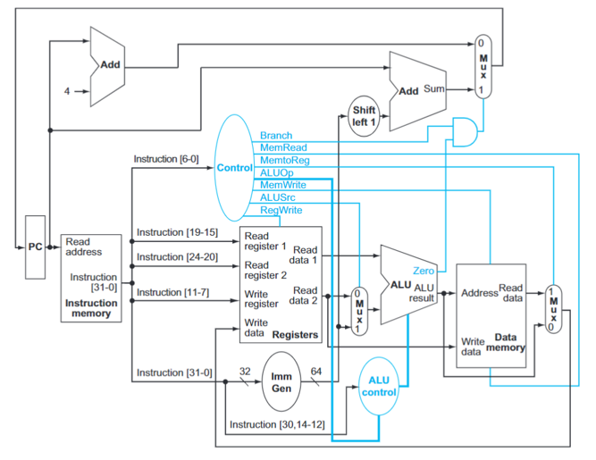
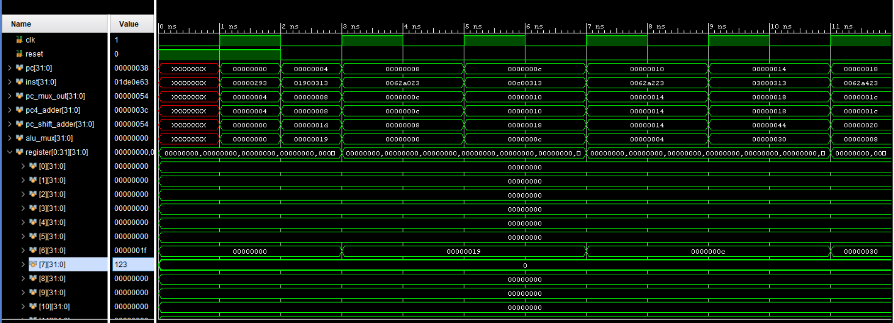

# Single-Cycle-RISCV-Processor
32-bit Single-Cycle RISC-V Processor designed in SystemVerilog.
===============================================================
A 32-bit Single-Cycle RISC-V Processor designed and implemented in SystemVerilog. This project demonstrates the fundamental architecture of a RISC-V CPU, including instruction fetch, decode, execute, memory access, and write-back operations within a single clock cycle.

---

## Overview

This processor is based on the RV32I instruction set architecture and was developed as part of my IC Design & Verification learning journey. The design integrates the essential components required for instruction execution and demonstrates the working of a complete single-cycle datapath.

---

## Processor Modules

- Program Counter (PC)
- Instruction Memory
- Control Unit
- Register File
- Immediate Generator
- ALU Control Unit
- Arithmetic Logic Unit (ALU)
- Data Memory
- Multiplexers (MUX)
- Branch Logic

---

## Supported Instructions

The processor currently supports the following RISC-V instructions:

- ADD
- ADDI
- SLLI
- LW
- SW
- BEQ

---

## Datapath



---

## Simulation Result



The processor was verified using a RISC-V assembly program that performs the summation of array elements. Simulation results confirm the correct execution of instruction fetch, decode, execute, memory access, and write-back operations.

---

## Verification

A testbench (`tb_TOP.sv`) is included for simulation and verification of the processor functionality.

Additionally, the repository contains:

- RISC-V Assembly Program (`sum_of_array.s`)
- Simulation Waveforms
- Processor Architecture Diagram

---

## Tools Used

- SystemVerilog
- AMD Vivado
- Ripes Simulator

---

## Repository Structure

```text
Single-Cycle-RISCV-Processor
│
├── TOP.sv
├── alu.sv
├── alu_control.sv
├── control_unit.sv
├── data_memory.sv
├── immediate_gen_32bit.sv
├── instruction_memory.sv
├── mux_32bit.sv
├── program_counter.sv
├── register_file.sv
├── tb_TOP.sv
├── sum_of_array.s
├── Single_Cycle_architecture.png
├── Single_Cycle_waveform1.png
└── README.md
```

---

## Future Improvements

- 5-Stage Pipelined RISC-V Processor
- Hazard Detection Unit
- Data Forwarding Unit
- Additional RV32I Instructions
- Branch Prediction Techniques

---

## Author

**Muhammad Sheharyar**

Applied Physics Graduate | IC Design & Verification Trainee @NECOP

GitHub:
https://github.com/Muhammad-sheharyar

LinkedIn:
[linkedin.com/in/m-sheharyar](https://www.linkedin.com/in/m-sheharyar/)
